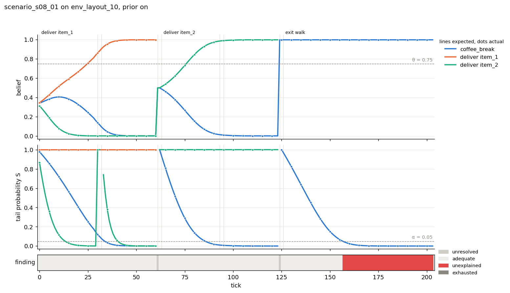
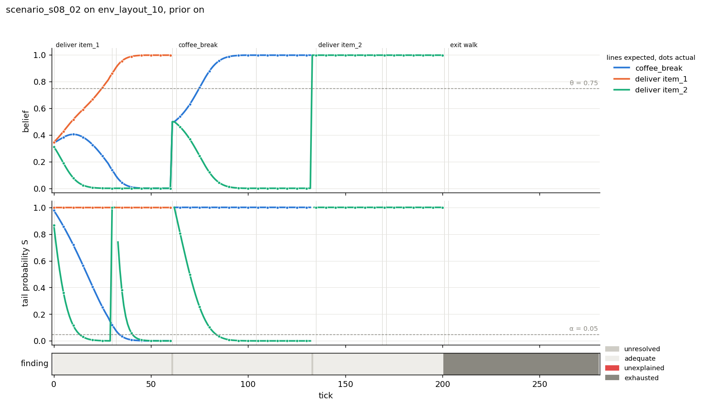
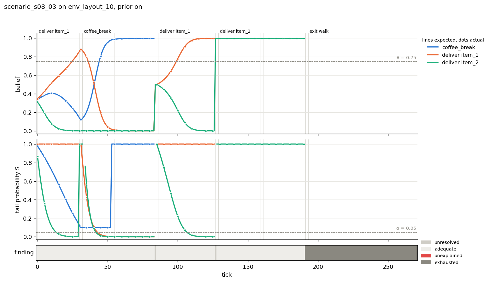
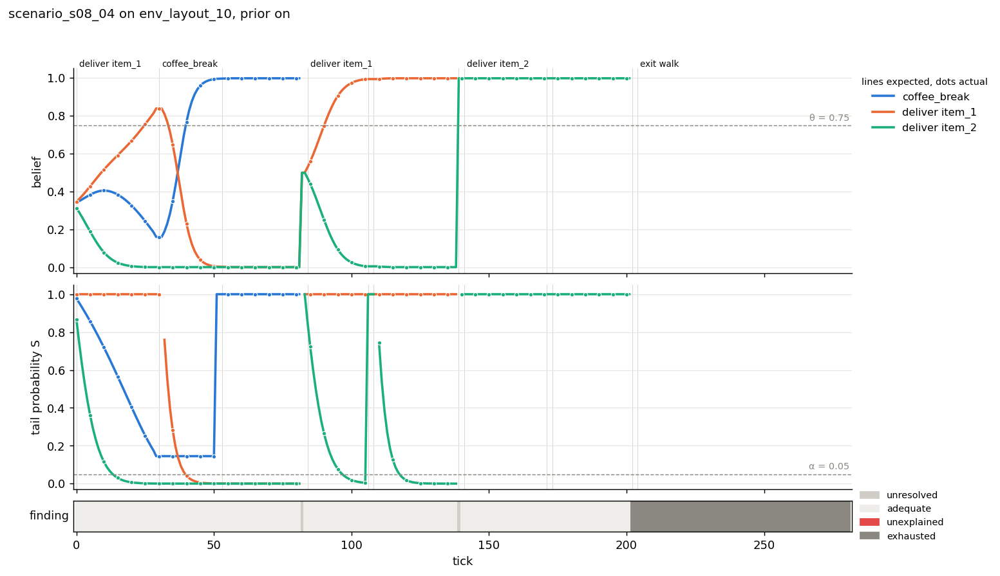

# The IR test-bed: report (TB.3b)

The recognizer in isolation on four scenarios written for it (design_decisions.md, "The IR test-bed"). The
expectations were derived from the recognizer records by an independent generator before the runs. The instrument,
its rules with their sources, and the readings R1 to R4 confirmed at the plan step are in `README.md`. Prior ON in
every run; α = 0.05; θ = 0.75 (the meta-planner's, marked for reference only: with an empty pool the robot decides
nothing after tick 0). 27 September 2026.

**What the comparison validates.** Under B the comparison validates the recognizer's public outputs against the
independent oracle; the recognizer's private expected action and origin are not independently validated, by choice.

## Results

### The replay against the run

Per scenario, the replay expanded per tick against the run's human lines (position to the log's 2 decimals, action,
micro), over every tick of the run:

| scenario | ticks | result |
|---|---|---|
| scenario_s08_01 | 0 to 203 | equal on every tick |
| scenario_s08_02 | 0 to 280 | equal on every tick |
| scenario_s08_03 | 0 to 270 | equal on every tick |
| scenario_s08_04 | 0 to 281 | equal on every tick |

The trajectory's source is the replay throughout. The fallback (reading the run's human lines) was not needed and is
not built. `actual.csv`'s full-precision world facts per tick (`holding`, `waited`, `obj_at`, `at`) also equal the
trajectory's on every tick (diff.md).

### The comparison

`expected.csv` against `actual.csv` (full precision, relative tolerance 1e-9) and against `actual_log.csv` (print
precision). The in-process run's `[IR*]` lines are byte-identical to the logged run's in all four scenarios.

| scenario | ticks compared | (tick, live hypothesis) rows | disagreements vs actual.csv | vs actual_log.csv | rows on one side only |
|---|---|---|---|---|---|
| scenario_s08_01 | 204 | 389 | 0 | 0 | 0 |
| scenario_s08_02 | 281 | 395 | 0 | 0 | 0 |
| scenario_s08_03 | 271 | 402 | 0 | 0 | 0 |
| scenario_s08_04 | 282 | 423 | 0 | 0 | 0 |

The columns compared are:

- **Per tick:** human position, micro, holding, waited, obj_at, at, most_likely, confidence, finding, lifecycle, pins
  and boundary.
- **Per live hypothesis:** belief, S, member and hypothesis adequacy.

Not compared, because the recognizer does not output them: expected action, origin, e, s, s_exp, D, L and evidence.
The generator's own R6 check (the evidence sums to 1 over exactly H) held on every tick.

**Disagreements, classified.** There are none in any scenario, so there is nothing to classify. The per-scenario
`diff.md` files carry the per-column counts.

**The instrument can fail.** The comparison was checked for its power: each mutation below was applied to a scratch
copy of `oracle.py` (never committed) and compared against the unchanged `actual.csv`. The counts are disagreements
per scenario (_01 / _02 / _03 / _04).

| mutation of the generator | disagreements |
|---|---|
| E9: the latency after a completion not priced (entry latency 0) | 273 / 181 / 294 / 137 |
| the boundary-tick rule removed (members on a boundary tick) | 11 / 11 / 11 / 11 |
| E6's second amendment removed (s ≤ s_exp a member only in a stationary phase) | 18 / 18 / 18 / 18 |
| the boundary's entry latency not priced | 354 / 327 / 235 / 215 |
| L not clipped at 1 | 33 / 99 / 142 / 223 |
| reading R1 reversed (STEP / STAND as completion signals) | 231 / 247 / 271 / 363 |
| reading R2 reversed (no floor before the scaling) | 190 / 238 / 249 / 292 |
| **E8's member clause removed** | **0 / 0 / 0 / 0** |

E8 is not exercised independently in these scenarios. Every phase an advance opens is entered from a completion, so
its s_exp ≥ 1 (E9), and its entry tick (s = 0 ≤ s_exp) is already a member under E6's second amendment. The four runs
therefore cannot tell E8's clause apart from its absence. This is a property of the test set, recorded, not a
disagreement.

## Per scenario

Each section has the script's actions per tick, the expected-action table (the oracle's derived phases, which the
comparison does not validate against the recognizer's private state; see above), the derived tick table of events,
and the descriptive trends read from `actual.csv`. The trends describe what the outputs do; they judge nothing. v·D
is recovered from the actual S by inverting E5's tail. Its split into e and the standing charge v·(s − s_exp) is read
from `expected.csv`, whose every compared column equals `actual.csv`.

The truth on a tick is the hypothesis of the task the human's action on that tick belongs to. The acknowledgement tick
counts with its action. The truth is none ("-") for the exit walk and the idle human, which no hypothesis describes.
The finding and each S also appear in `figure.png`.

### scenario_s08_01

**Comparison:** 0 disagreements (204 ticks, 389 hypothesis rows). **Trends (actual):**
- **deliver item_1.** It leads from tick 0 and first reaches θ at 25, on its walk to shelf_1.
- **deliver item_2 while item_1 is the truth.** Its S falls below α at 14 on the first walk (e 357 cm). After the
  grasp at 30 its method becomes `deliver_with_return`: it expects `place(item_1, shelf_1)` (30 to 31), then
  `move_to(shelf_1)` from 32, and its S falls below α again at 41 (e 360 cm).
- **coffee_break.** Its S falls below α at 34: e 285 cm, plus 60 cm for the three standing ticks at the shelf,
  charged against its walk (s_exp 0). It falls below α again at 86, on deliver item_2's walk.
- **The boundaries at 61 and 124.** Each gives unresolved on the boundary tick and adequate on the next.
- **deliver item_2 as the truth.** It first reaches θ at 76.
- **The exit walk.** From 124 coffee_break is the lone live hypothesis, at 0.998. Its S falls below α at 157, 31
  ticks into the walk (v·D 344 cm, all excess), and the finding is unexplained from 157 to the end of the run (203).
  That span covers the rest of the walk (last step 172) and the idle stand. The run holds no unexplained tick while
  a task the robot models is on the human's stack.

Script actions (replay expanded per tick; the first tick of each action):

| tick | task | action | occurrence |
|---|---|---|---|
| 0 | deliver item_1 | move_to | 0 |
| 30 | deliver item_1 | pick_up | 0 |
| 32 | deliver item_1 | move_to | 1 |
| 61 | deliver item_1 | place | 0 |
| 63 | deliver item_2 | move_to | 0 |
| 93 | deliver item_2 | pick_up | 0 |
| 95 | deliver item_2 | move_to | 1 |
| 124 | deliver item_2 | place | 0 |
| 126 | go_to(?landmark=corner_SE) | move_to | 0 |

Last acknowledgement tick 173; idle from 174 to 203.

Expected action per hypothesis (the oracle's derived phases; ticks inclusive, -1 the observation before the clock starts; after the pin the hypothesis is retired):

| hypothesis | expected action | ticks |
|---|---|---|
| coffee_break | move_to(?target=coffee_machine_0) | -1 to 203 |
| deliver item_1 | move_to(?target=item_1) | -1 to 27 |
| deliver item_1 | pick_up(?item=item_1) | 28 to 29 |
| deliver item_1 | move_to(?target=kitting_table_0) | 30 to 58 |
| deliver item_1 | place(?item=item_1,?target=kitting_table_0) | 59 to 60 |
| deliver item_2 | move_to(?target=item_2) | -1 to 29 |
| deliver item_2 | place(?item=item_1,?target=shelf_1) | 30 to 31 |
| deliver item_2 | move_to(?target=shelf_1) | 32 to 60 |
| deliver item_2 | move_to(?target=item_2) | 61 to 90 |
| deliver item_2 | pick_up(?item=item_2) | 91 to 92 |
| deliver item_2 | move_to(?target=kitting_table_0) | 93 to 121 |
| deliver item_2 | place(?item=item_2,?target=kitting_table_0) | 122 to 123 |

Events (actual):

| tick | event |
|---|---|
| 61 | boundary |
| 61 | pin deliver item_1 |
| 124 | boundary |
| 124 | pin deliver item_2 |

True hypothesis and θ (actual): per contiguous stretch of ticks on which the hypothesis is the truth, its first tick with belief ≥ θ, its belief and hypothesis adequacy there, and whether it leads.

| true hypothesis | ticks | first tick ≥ θ | belief | leads | hypothesis adequacy |
|---|---|---|---|---|---|
| deliver item_1 | 0 to 62 | 25 | 0.7552 | yes | adequate |
| deliver item_2 | 63 to 125 | 76 | 0.7560 | yes | adequate |

Refutations (actual): each tick on which a hypothesis's S falls below α = 0.05 (from ≥ α or from no observation), its belief there and the v·D that took it there (from S); e and v·(s − s_exp) from expected.csv; the truth on that tick.

| tick | hypothesis | expected action | belief | S | v·D (cm) | e (cm) | v·(s − s_exp) (cm) | truth |
|---|---|---|---|---|---|---|---|---|
| 14 | deliver item_2 | move_to(?target=item_2) | 0.0315 | 0.0399 | 357.3 | 357.3 | 0.0 | deliver item_1 |
| 34 | coffee_break | move_to(?target=coffee_machine_0) | 0.0579 | 0.0451 | 345.0 | 285.0 | 60.0 | deliver item_1 |
| 41 | deliver item_2 | move_to(?target=shelf_1) | 0.0010 | 0.0389 | 360.0 | 360.0 | 0.0 | deliver item_1 |
| 86 | coffee_break | move_to(?target=coffee_machine_0) | 0.0582 | 0.0453 | 344.4 | 344.4 | 0.0 | deliver item_2 |
| 157 | coffee_break | move_to(?target=coffee_machine_0) | 0.9980 | 0.0456 | 343.9 | 343.9 | 0.0 | - |

Finding transitions (actual; `exhausted` is the lifecycle state, no finding):

| tick | from | to | truth |
|---|---|---|---|
| 0 | - | adequate | deliver item_1 |
| 61 | adequate | unresolved | deliver item_1 |
| 62 | unresolved | adequate | deliver item_1 |
| 124 | adequate | unresolved | deliver item_2 |
| 125 | unresolved | adequate | deliver item_2 |
| 157 | adequate | unexplained | - |

Exit walk (go_to corner_SE): first step 126, last step 172, acknowledgement 173; the idle human from 174. Live at its first tick: coffee_break.

- coffee_break: belief 0.9980 at 126; S < α from 157 (belief 0.9980; v·D 343.9 cm); the finding unexplained from 157.

### scenario_s08_02

**Comparison:** 0 disagreements (281 ticks, 395 hypothesis rows). **Trends (actual):**
- **deliver item_1.** As in _01 up to its boundary at 61: θ first reached at 25; deliver item_2 below α at 14 and 41;
  coffee_break below α at 34.
- **The coffee_break.** After the boundary at 61, coffee_break and deliver item_2 start at 0.4995 each. coffee_break
  first reaches θ at 75, on its walk to the machine, and deliver item_2's S falls below α at 84 (e 350 cm).
- **The coffee pin at 133** (the last STAND of its wait; a boundary). From 133 deliver item_2 is the lone live
  hypothesis at 0.998, the value at its first truth tick (135). Unresolved at 133, adequate from 134.
- **The second delivery's pin at 201** is a boundary, and the lifecycle is exhausted from 201. There is no finding on
  the rest of the delivery's acknowledgement, on the exit walk (203 to 250) or on the idle stand.

Script actions (replay expanded per tick; the first tick of each action):

| tick | task | action | occurrence |
|---|---|---|---|
| 0 | deliver item_1 | move_to | 0 |
| 30 | deliver item_1 | pick_up | 0 |
| 32 | deliver item_1 | move_to | 1 |
| 61 | deliver item_1 | place | 0 |
| 63 | coffee_break | move_to | 0 |
| 104 | coffee_break | wait_at | 0 |
| 135 | deliver item_2 | move_to | 0 |
| 169 | deliver item_2 | pick_up | 0 |
| 171 | deliver item_2 | move_to | 1 |
| 201 | deliver item_2 | place | 0 |
| 203 | go_to(?landmark=corner_SE) | move_to | 0 |

Last acknowledgement tick 250; idle from 251 to 280.

Expected action per hypothesis (the oracle's derived phases; ticks inclusive, -1 the observation before the clock starts; after the pin the hypothesis is retired):

| hypothesis | expected action | ticks |
|---|---|---|
| coffee_break | move_to(?target=coffee_machine_0) | -1 to 101 |
| coffee_break | wait_at(?duration=PT60S,?entity=coffee_machine_0) | 102 to 132 |
| deliver item_1 | move_to(?target=item_1) | -1 to 27 |
| deliver item_1 | pick_up(?item=item_1) | 28 to 29 |
| deliver item_1 | move_to(?target=kitting_table_0) | 30 to 58 |
| deliver item_1 | place(?item=item_1,?target=kitting_table_0) | 59 to 60 |
| deliver item_2 | move_to(?target=item_2) | -1 to 29 |
| deliver item_2 | place(?item=item_1,?target=shelf_1) | 30 to 31 |
| deliver item_2 | move_to(?target=shelf_1) | 32 to 60 |
| deliver item_2 | move_to(?target=item_2) | 61 to 166 |
| deliver item_2 | pick_up(?item=item_2) | 167 to 168 |
| deliver item_2 | move_to(?target=kitting_table_0) | 169 to 198 |
| deliver item_2 | place(?item=item_2,?target=kitting_table_0) | 199 to 200 |

Events (actual):

| tick | event |
|---|---|
| 61 | boundary |
| 61 | pin deliver item_1 |
| 133 | boundary |
| 133 | pin coffee_break |
| 201 | boundary |
| 201 | exhausted (no live hypothesis) from here |
| 201 | pin deliver item_2 |

True hypothesis and θ (actual): per contiguous stretch of ticks on which the hypothesis is the truth, its first tick with belief ≥ θ, its belief and hypothesis adequacy there, and whether it leads.

| true hypothesis | ticks | first tick ≥ θ | belief | leads | hypothesis adequacy |
|---|---|---|---|---|---|
| deliver item_1 | 0 to 62 | 25 | 0.7552 | yes | adequate |
| coffee_break | 63 to 134 | 75 | 0.7552 | yes | adequate |
| deliver item_2 | 135 to 202 | 135 | 0.9980 | yes | adequate |

Refutations (actual): each tick on which a hypothesis's S falls below α = 0.05 (from ≥ α or from no observation), its belief there and the v·D that took it there (from S); e and v·(s − s_exp) from expected.csv; the truth on that tick.

| tick | hypothesis | expected action | belief | S | v·D (cm) | e (cm) | v·(s − s_exp) (cm) | truth |
|---|---|---|---|---|---|---|---|---|
| 14 | deliver item_2 | move_to(?target=item_2) | 0.0315 | 0.0399 | 357.3 | 357.3 | 0.0 | deliver item_1 |
| 34 | coffee_break | move_to(?target=coffee_machine_0) | 0.0579 | 0.0451 | 345.0 | 285.0 | 60.0 | deliver item_1 |
| 41 | deliver item_2 | move_to(?target=shelf_1) | 0.0010 | 0.0389 | 360.0 | 360.0 | 0.0 | deliver item_1 |
| 84 | deliver item_2 | move_to(?target=item_2) | 0.0554 | 0.0430 | 349.9 | 349.9 | 0.0 | coffee_break |

Finding transitions (actual; `exhausted` is the lifecycle state, no finding):

| tick | from | to | truth |
|---|---|---|---|
| 0 | - | adequate | deliver item_1 |
| 61 | adequate | unresolved | deliver item_1 |
| 62 | unresolved | adequate | deliver item_1 |
| 133 | adequate | unresolved | coffee_break |
| 134 | unresolved | adequate | coffee_break |
| 201 | adequate | exhausted | deliver item_2 |

Exit walk (go_to corner_SE): first step 203, last step 249, acknowledgement 250; the idle human from 251. Live at its first tick: none (exhausted).

### scenario_s08_03

**Comparison:** 0 disagreements (271 ticks, 402 hypothesis rows). **Trends (actual):**
- **deliver item_1 before the coffee.** It first reaches θ at 25, and its grasp is at 30. The coffee_break starts at
  32 with item_1 in hand.
- **The walk to the machine** (32 to about 52; arrival advances coffee_break to `wait_at` at 53):
  - deliver item_1 is `deliver_already_held` and expects `move_to(kitting_table_0)` from 30 to 124, one derived
    phase across the break. Its S falls below α at 43 (e 348 cm), at belief 0.312.
  - deliver item_2 is in its return (`move_to(shelf_1)` from 33) and falls below α at 42.
  - coffee_break first reaches θ at 45 (0.804). Its S stays at 0.0988 from 31 to 52: the excess it gathered during
    the walk to the shelf and the standing there, with the straight walk at the machine adding none. It reads 1 from
    53, in `wait_at`.
  - The finding stays adequate throughout.
- **The coffee pin at 84** (a boundary). Both deliveries go to 0.4995. Unresolved at 84, adequate from 85.
- **The resumption at 86** re-expands the carry to the table (the delivery's phase, unchanged): deliver item_1 first
  reaches θ again at 100 (0.778), and deliver item_2 falls below α at 107.
- **deliver item_1's pin at 127** (a boundary) leaves deliver item_2 lone at 0.998.
- **Exhaustion.** deliver item_2's pin at 191 exhausts the lifecycle, and the exit walk (193 to 240) has no finding.

Script actions (replay expanded per tick; the first tick of each action):

| tick | task | action | occurrence |
|---|---|---|---|
| 0 | deliver item_1 | move_to | 0 |
| 30 | deliver item_1 | pick_up | 0 |
| 32 | coffee_break | move_to | 0 |
| 55 | coffee_break | wait_at | 0 |
| 86 | deliver item_1 | move_to | 0 |
| 127 | deliver item_1 | place | 0 |
| 129 | deliver item_2 | move_to | 0 |
| 159 | deliver item_2 | pick_up | 0 |
| 161 | deliver item_2 | move_to | 1 |
| 191 | deliver item_2 | place | 0 |
| 193 | go_to(?landmark=corner_SE) | move_to | 0 |

Last acknowledgement tick 240; idle from 241 to 270.

Expected action per hypothesis (the oracle's derived phases; ticks inclusive, -1 the observation before the clock starts; after the pin the hypothesis is retired):

| hypothesis | expected action | ticks |
|---|---|---|
| coffee_break | move_to(?target=coffee_machine_0) | -1 to 52 |
| coffee_break | wait_at(?duration=PT60S,?entity=coffee_machine_0) | 53 to 83 |
| deliver item_1 | move_to(?target=item_1) | -1 to 27 |
| deliver item_1 | pick_up(?item=item_1) | 28 to 29 |
| deliver item_1 | move_to(?target=kitting_table_0) | 30 to 124 |
| deliver item_1 | place(?item=item_1,?target=kitting_table_0) | 125 to 126 |
| deliver item_2 | move_to(?target=item_2) | -1 to 29 |
| deliver item_2 | place(?item=item_1,?target=shelf_1) | 30 to 32 |
| deliver item_2 | move_to(?target=shelf_1) | 33 to 126 |
| deliver item_2 | move_to(?target=item_2) | 127 to 156 |
| deliver item_2 | pick_up(?item=item_2) | 157 to 158 |
| deliver item_2 | move_to(?target=kitting_table_0) | 159 to 188 |
| deliver item_2 | place(?item=item_2,?target=kitting_table_0) | 189 to 190 |

Events (actual):

| tick | event |
|---|---|
| 84 | boundary |
| 84 | pin coffee_break |
| 127 | boundary |
| 127 | pin deliver item_1 |
| 191 | boundary |
| 191 | exhausted (no live hypothesis) from here |
| 191 | pin deliver item_2 |

True hypothesis and θ (actual): per contiguous stretch of ticks on which the hypothesis is the truth, its first tick with belief ≥ θ, its belief and hypothesis adequacy there, and whether it leads.

| true hypothesis | ticks | first tick ≥ θ | belief | leads | hypothesis adequacy |
|---|---|---|---|---|---|
| deliver item_1 | 0 to 31 | 25 | 0.7552 | yes | adequate |
| coffee_break | 32 to 85 | 45 | 0.8044 | yes | adequate |
| deliver item_1 | 86 to 128 | 100 | 0.7779 | yes | adequate |
| deliver item_2 | 129 to 192 | 129 | 0.9980 | yes | adequate |

Refutations (actual): each tick on which a hypothesis's S falls below α = 0.05 (from ≥ α or from no observation), its belief there and the v·D that took it there (from S); e and v·(s − s_exp) from expected.csv; the truth on that tick.

| tick | hypothesis | expected action | belief | S | v·D (cm) | e (cm) | v·(s − s_exp) (cm) | truth |
|---|---|---|---|---|---|---|---|---|
| 14 | deliver item_2 | move_to(?target=item_2) | 0.0315 | 0.0399 | 357.3 | 357.3 | 0.0 | deliver item_1 |
| 42 | deliver item_2 | move_to(?target=shelf_1) | 0.0010 | 0.0422 | 351.8 | 351.8 | 0.0 | coffee_break |
| 43 | deliver item_1 | move_to(?target=kitting_table_0) | 0.3117 | 0.0440 | 347.5 | 347.5 | 0.0 | coffee_break |
| 107 | deliver item_2 | move_to(?target=shelf_1) | 0.0553 | 0.0429 | 350.0 | 350.0 | 0.0 | deliver item_1 |

Finding transitions (actual; `exhausted` is the lifecycle state, no finding):

| tick | from | to | truth |
|---|---|---|---|
| 0 | - | adequate | deliver item_1 |
| 84 | adequate | unresolved | coffee_break |
| 85 | unresolved | adequate | coffee_break |
| 127 | adequate | unresolved | deliver item_1 |
| 128 | unresolved | adequate | deliver item_1 |
| 191 | adequate | exhausted | deliver item_2 |

Across the coffee boundary (actual): the coffee_break starts at 32 (its walk), is pinned at 84 (the boundary), and the suspended delivery resumes at 86.

| tick | human action | truth | coffee_break belief / S | deliver item_1 belief / S | deliver item_2 belief / S | finding |
|---|---|---|---|---|---|---|
| 30 | pick_up grasp | deliver item_1 | 0.1374 / 0.1199 | 0.8616 / 1.0000 | 0.0010 / 1.0000 | adequate |
| 31 | pick_up  | deliver item_1 | 0.1169 / 0.0989 | 0.8821 / 1.0000 | 0.0010 / 1.0000 | adequate |
| 32 | move_to step | coffee_break | 0.1319 / 0.0989 | 0.8671 / 0.8248 | 0.0010 / 1.0000 | adequate |
| 33 | move_to step | coffee_break | 0.1511 / 0.0989 | 0.8479 / 0.6702 | 0.0010 / - | adequate |
| 34 | move_to step | coffee_break | 0.1756 / 0.0989 | 0.8234 / 0.5366 | 0.0010 / 0.7594 | adequate |
| 83 | wait_at stand | coffee_break | 0.9980 / 1.0000 | 0.0010 / 0.0000 | 0.0010 / 0.0000 | adequate |
| 84 | wait_at stand | coffee_break | retired | 0.4995 / - | 0.4995 / - | unresolved |
| 85 | wait_at  | coffee_break | retired | 0.4995 / 1.0000 | 0.4995 / 1.0000 | adequate |
| 86 | move_to step | deliver item_1 | retired | 0.5076 / 1.0000 | 0.4914 / 0.9544 | adequate |
| 87 | move_to step | deliver item_1 | retired | 0.5167 / 1.0000 | 0.4823 / 0.9068 | adequate |
| 88 | move_to step | deliver item_1 | retired | 0.5269 / 1.0000 | 0.4721 / 0.8571 | adequate |

Exit walk (go_to corner_SE): first step 193, last step 239, acknowledgement 240; the idle human from 241. Live at its first tick: none (exhausted).

### scenario_s08_04

**Comparison:** 0 disagreements (282 ticks, 423 hypothesis rows). **Trends (actual):**
- **deliver item_1 before the coffee.** It first reaches θ at 25. Its walk to shelf_1 is acknowledged at 29, and the
  coffee_break starts at 30, empty-handed at the shelf.
- **Leaving the shelf.** deliver item_1 had advanced to `pick_up` at 28. As the human leaves the shelf, `at` stops
  holding and the hypothesis regresses to `move_to(item_1)` at 31, a phase that runs 31 to 103 across the break. Its
  entry tick 31 holds no observation (s_exp 0, nothing walked yet). Its S falls below α at 40 (e 352 cm), at belief
  0.231, the tick coffee_break first reaches θ (0.768).
- **The coffee_break.** Its S is 0.1451 from 29 to 50 (the same reading as in _03, with no walk away first), and 1
  from 51, in `wait_at`.
- **The coffee pin at 82** (a boundary). Both deliveries go to 0.4995. Unresolved at 82, adequate from 83.
- **The resumption at 84** walks back to shelf_1: deliver item_1 first reaches θ again at 91 (0.785), and deliver
  item_2 falls below α at 97 (e 345 cm). After the grasp (104 to 105) item_2 is in its return (`move_to(shelf_1)`
  from 109) and falls below α again at 118.
- **deliver item_1's pin at 139** (a boundary) leaves deliver item_2 lone at 0.998.
- **Exhaustion.** deliver item_2's pin at 202 exhausts the lifecycle, and the exit walk (204 to 251) has no finding.

Script actions (replay expanded per tick; the first tick of each action):

| tick | task | action | occurrence |
|---|---|---|---|
| 0 | deliver item_1 | move_to | 0 |
| 30 | coffee_break | move_to | 0 |
| 53 | coffee_break | wait_at | 0 |
| 84 | deliver item_1 | move_to | 0 |
| 106 | deliver item_1 | pick_up | 0 |
| 108 | deliver item_1 | move_to | 1 |
| 139 | deliver item_1 | place | 0 |
| 141 | deliver item_2 | move_to | 0 |
| 171 | deliver item_2 | pick_up | 0 |
| 173 | deliver item_2 | move_to | 1 |
| 202 | deliver item_2 | place | 0 |
| 204 | go_to(?landmark=corner_SE) | move_to | 0 |

Last acknowledgement tick 251; idle from 252 to 281.

Expected action per hypothesis (the oracle's derived phases; ticks inclusive, -1 the observation before the clock starts; after the pin the hypothesis is retired):

| hypothesis | expected action | ticks |
|---|---|---|
| coffee_break | move_to(?target=coffee_machine_0) | -1 to 50 |
| coffee_break | wait_at(?duration=PT60S,?entity=coffee_machine_0) | 51 to 81 |
| deliver item_1 | move_to(?target=item_1) | -1 to 27 |
| deliver item_1 | pick_up(?item=item_1) | 28 to 30 |
| deliver item_1 | move_to(?target=item_1) | 31 to 103 |
| deliver item_1 | pick_up(?item=item_1) | 104 to 105 |
| deliver item_1 | move_to(?target=kitting_table_0) | 106 to 136 |
| deliver item_1 | place(?item=item_1,?target=kitting_table_0) | 137 to 138 |
| deliver item_2 | move_to(?target=item_2) | -1 to 105 |
| deliver item_2 | place(?item=item_1,?target=shelf_1) | 106 to 108 |
| deliver item_2 | move_to(?target=shelf_1) | 109 to 138 |
| deliver item_2 | move_to(?target=item_2) | 139 to 168 |
| deliver item_2 | pick_up(?item=item_2) | 169 to 170 |
| deliver item_2 | move_to(?target=kitting_table_0) | 171 to 199 |
| deliver item_2 | place(?item=item_2,?target=kitting_table_0) | 200 to 201 |

Events (actual):

| tick | event |
|---|---|
| 82 | boundary |
| 82 | pin coffee_break |
| 139 | boundary |
| 139 | pin deliver item_1 |
| 202 | boundary |
| 202 | exhausted (no live hypothesis) from here |
| 202 | pin deliver item_2 |

True hypothesis and θ (actual): per contiguous stretch of ticks on which the hypothesis is the truth, its first tick with belief ≥ θ, its belief and hypothesis adequacy there, and whether it leads.

| true hypothesis | ticks | first tick ≥ θ | belief | leads | hypothesis adequacy |
|---|---|---|---|---|---|
| deliver item_1 | 0 to 29 | 25 | 0.7552 | yes | adequate |
| coffee_break | 30 to 83 | 40 | 0.7678 | yes | adequate |
| deliver item_1 | 84 to 140 | 91 | 0.7854 | yes | adequate |
| deliver item_2 | 141 to 203 | 141 | 0.9980 | yes | adequate |

Refutations (actual): each tick on which a hypothesis's S falls below α = 0.05 (from ≥ α or from no observation), its belief there and the v·D that took it there (from S); e and v·(s − s_exp) from expected.csv; the truth on that tick.

| tick | hypothesis | expected action | belief | S | v·D (cm) | e (cm) | v·(s − s_exp) (cm) | truth |
|---|---|---|---|---|---|---|---|---|
| 14 | deliver item_2 | move_to(?target=item_2) | 0.0315 | 0.0399 | 357.3 | 357.3 | 0.0 | deliver item_1 |
| 40 | deliver item_1 | move_to(?target=item_1) | 0.2312 | 0.0422 | 351.8 | 351.8 | 0.0 | coffee_break |
| 97 | deliver item_2 | move_to(?target=item_2) | 0.0578 | 0.0450 | 345.2 | 345.2 | 0.0 | deliver item_1 |
| 118 | deliver item_2 | move_to(?target=shelf_1) | 0.0010 | 0.0395 | 358.3 | 358.3 | 0.0 | deliver item_1 |

Finding transitions (actual; `exhausted` is the lifecycle state, no finding):

| tick | from | to | truth |
|---|---|---|---|
| 0 | - | adequate | deliver item_1 |
| 82 | adequate | unresolved | coffee_break |
| 83 | unresolved | adequate | coffee_break |
| 139 | adequate | unresolved | deliver item_1 |
| 140 | unresolved | adequate | deliver item_1 |
| 202 | adequate | exhausted | deliver item_2 |

Across the coffee boundary (actual): the coffee_break starts at 30 (its walk), is pinned at 82 (the boundary), and the suspended delivery resumes at 84.

| tick | human action | truth | coffee_break belief / S | deliver item_1 belief / S | deliver item_2 belief / S | finding |
|---|---|---|---|---|---|---|
| 28 | move_to step | deliver item_1 | 0.1861 / 0.1754 | 0.8129 / 1.0000 | 0.0010 / 0.0005 | adequate |
| 29 | move_to  | deliver item_1 | 0.1605 / 0.1451 | 0.8385 / 1.0000 | 0.0010 / 0.0004 | adequate |
| 30 | move_to step | coffee_break | 0.1605 / 0.1451 | 0.8385 / 1.0000 | 0.0010 / 0.0004 | adequate |
| 31 | move_to step | coffee_break | 0.1605 / 0.1451 | 0.8385 / - | 0.0010 / 0.0004 | adequate |
| 32 | move_to step | coffee_break | 0.1893 / 0.1451 | 0.8097 / 0.7594 | 0.0010 / 0.0003 | adequate |
| 81 | wait_at stand | coffee_break | 0.9980 / 1.0000 | 0.0010 / 0.0000 | 0.0010 / 0.0000 | adequate |
| 82 | wait_at stand | coffee_break | retired | 0.4995 / - | 0.4995 / - | unresolved |
| 83 | wait_at  | coffee_break | retired | 0.4995 / 1.0000 | 0.4995 / 1.0000 | adequate |
| 84 | move_to step | deliver item_1 | retired | 0.5273 / 1.0000 | 0.4717 / 0.8554 | adequate |
| 85 | move_to step | deliver item_1 | retired | 0.5585 / 1.0000 | 0.4405 / 0.7235 | adequate |
| 86 | move_to step | deliver item_1 | retired | 0.5928 / 1.0000 | 0.4062 / 0.6050 | adequate |

Exit walk (go_to corner_SE): first step 204, last step 250, acknowledgement 251; the idle human from 252. Live at its first tick: none (exhausted).

## The recognizer behaves this way, and what that says about the design

- **What the agreement establishes.** Every compared output of the recognizer, on every tick of four runs, equals
  what the records at HEAD specify, as read with R1 to R4. So "the recognizer behaves this way" and "this is what the
  current records prescribe" coincide for every public output compared here.
- **What it does not establish.**
  - It is not evidence that the design is right.
  - It is not evidence for the private state (the expected action and the origin), which is not independently
    validated (option B).
  - It says nothing about E8's clause, which these scenarios do not exercise (see "The instrument can fail").
- **Behaviours that follow from the records, stated as such, not ruled on:**
  1. **The rival delivery after a grasp.** It is measured against a return of the carried item to its home shelf
     (`deliver_with_return`), not against its own item: first `place(item_1, shelf_1)`, with no progress evaluator
     (e = 0), then, once `at(shelf_1)` stops holding, `move_to(shelf_1)` (_01 ticks 30 to 60; the same in every
     scenario).
  2. **Standing charged to a walk.** Standing at a shelf is charged against a rival's open walk phase with s_exp 0
     (coffee_break in _01 and _02 at 34: 60 cm of its 345).
  3. **The sequence at a boundary.** Each boundary gives unresolved (b), then adequate (b + 1), as recorded in 1.5c
     (8 boundaries with a live successor: 61 and 124 in _01; 61 and 133 in _02; 84 and 127 in _03; 82 and 139 in
     _04). The other three boundaries (201, 191, 202) exhaust the lifecycle.
  4. **A lone live hypothesis.** It reads 0.998 at once, by normalisation (R1): deliver item_2 from the coffee pin
     in _02, from deliver item_1's pin in _03 and _04, and coffee_break from 124 in _01.
  5. **The finding is existential.** While a true coffee_break is adequate, a delivery whose S is below α leaves the
     finding adequate (_03 from 43, _04 from 40).

## _03 and _04: mechanical, L not resolved

_03 and _04 test suspended task states, which are L's subject. Their expectations are generated mechanically from
the current records. Among them:

- the delivery's derived phase spans the break (_03: `move_to(kitting_table_0)` from 30 to 124; _04:
  `move_to(item_1)` from 31 to 103);
- the coffee pin is an episode boundary that resets both deliveries to 0.4995;
- in _04, the regress at the proximity threshold as the human leaves the shelf.

The recognizer agrees with each of these. Whether any of them is what L should prescribe is not answered here.

## The coffee retirement

- **_02, _03, _04.** coffee_break is pinned when `waited` first holds, on the last STAND of its wait: 133 (_02),
  84 (_03), 82 (_04), each a boundary. It stays retired for the run. The second delivery's pin then leaves no
  hypothesis live: the lifecycle is exhausted from 201 (_02), 191 (_03) and 202 (_04), including the exit walk (first
  step 203, 193, 204; acknowledgement 250, 240, 251) and the idle stand. No finding is reported on those ticks
  (80 ticks in each).
- **_01.** coffee_break is never pinned. After deliver item_2's pin at 124 it is the lone live hypothesis, at 0.998.
  Its phase is still the `move_to(coffee_machine_0)` it has expected since tick −1, with its origin moved at each
  boundary. On the exit walk (126 to 172) its excess grows: S falls below α at 157 (v·D 344 cm, all excess), and the
  finding is unexplained from 157 to 203. That span is 47 ticks: the rest of the walk and the 30 ticks of the idle
  human. This is TODO-117's case by construction, as the entry states.

## Runs and tests that disagree with the mechanism

- **The four test-bed runs.** None: 0 disagreements against the records as read.
- **`tests/test_tl2_discovery.py::test_the_registry_is_the_union_of_the_modules`.** It failed on the new artefacts
  because it pins the registry's inventory as a literal (38 scenarios, setups 01 to 07). That is an inventory count,
  not a mechanism. It was updated to 42 scenarios and setups 01 to 08 in the artefacts commit, and the full suite
  passes (135).
- **The maintained baselines.** The tb1a sweep (the five regression fixtures and the three evaluation fixtures, both
  priors: 16 logs and their `.rec`) is byte-identical to its README's TB.2b section, 32 of 32 md5s. No code on the
  run path changed.

## What the records leave undetermined, and what the instrument decided

- **For the oracle:** the readings R1 to R4 (README), confirmed by Hadi at the plan step. No other choice was needed:
  every value compared follows from the records and the domain's structure.
- **Choices of the instrument, not of the oracle.** None of them feeds a compared value.
  - The oracle's world holds only the observed human's facts. No hypothesis of the human reads the robot's.
  - `AgentState.current_zone` is "unknown", which the decomposition does not read.
  - Tick −1 is not compared (R4).
  - In the trends, the truth on an acknowledgement tick is the acknowledged action's task.
  - In the trends, v·D is recovered from the actual S.

## Flags (outside scope, not fixed)

1. **`analysis/td_stage1b/tdlib.py`.** Its `[coverage]` pattern does not match a `[coverage]` line with a `start:`
   entry (any script with a `Start` event), and `parse` then raises. `actual.py` works around it by handing tdlib the
   log without those lines. tdlib is a frozen record, so it is not edited.
2. **E8 is not exercised independently** by any of the four scenarios (above). Under E9's latency pricing and E6's
   second amendment, E8's clause adds a member only where an advance opens a phase with s_exp = 0. That would need a
   completion latency of 0, which Mesa does not have. A design question for a cycle, if wanted; not a disagreement.
3. **The inventory literal in `test_tl2_discovery.py`** must be edited with every new scenario or setup.
