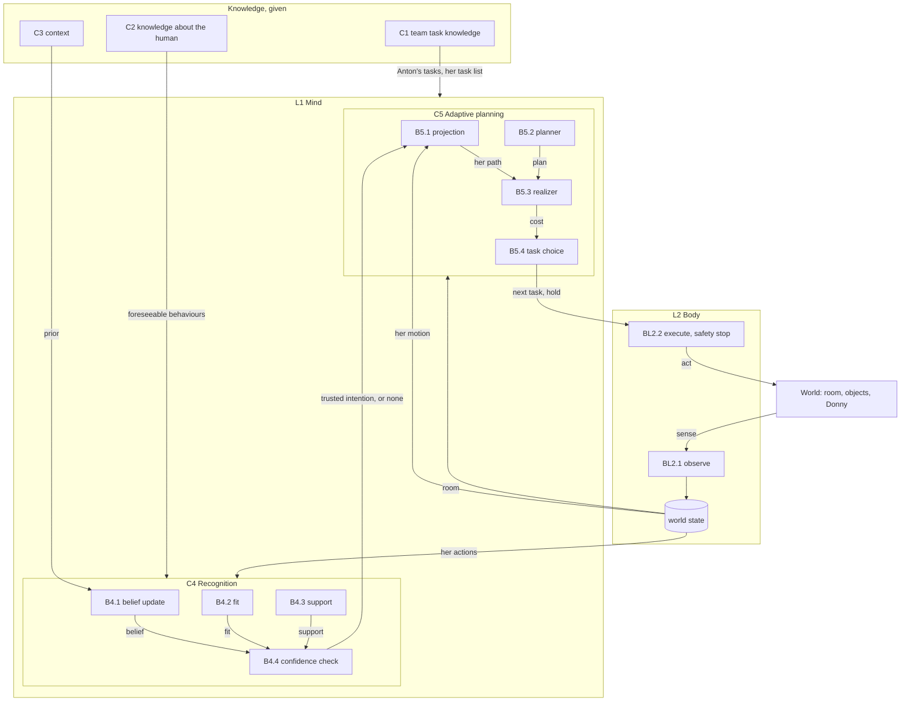

# TeamRob handoff: the demo-day talk (T-pres), content and build in one chat

Written 8 October 2026 by the content design chat (cchat), for a new chat that takes over both the content and the
technical build of the talk. Hadi places this file in the repo's docs. The repo is authoritative for every fact about
the framework; this file is authoritative only for what was discussed and preferred about the talk.

## 0. How to read this file

- [preferred]: Hadi's preference for the talk. For presentation and web work Hadi uses "preferred", not "ruled".
  A preference is the default for now and may change.
- [open]: discussed, not settled.
- [parked]: deliberately put aside, to be taken up later.
- Section 8 lists repo facts verified on 8 October 2026. Verify again before a fact goes on a slide.
- The new chat runs content and technical work together (Hadi's choice, 8 October 2026), so nothing goes back and
  forth between two chats.

## 1. The occasion

- The final day of the TeamRob project. A talk of about 30 minutes plus 5 minutes of questions, in the morning, in a
  hall, on a projector and a large curtain screen, from Hadi's own laptop over HDMI, with a pointer.
- Audience: mostly industrial partners (Volvo GTO, with whom kitting was defined; Scania, with whom dock loading was
  defined; Epiroc; Volvo CE; others), TeamRob and computer-science colleagues, and a person from KKS, the funder.
  Some have seen earlier versions of the work; most of the work presented was done July to October 2026.
- In the afternoon the same people visit a 1.5 hour demo and mingle session. Hadi's station runs the web-ui for
  visitors. The talk is the entry point to that station.
- TeamRob has four subprojects, SP1 to SP4. Hadi's work is SP4 (intention recognition), done as a synergy with SP3,
  which entered as the planning side of the framework. The P and S numbers in Todor's demo-day deck are only labels
  for posters and screens.
- Time is budgeted at section level only (for example 5 + 7 + 7 + 8 + 3). No per-slide timing.
- Low priority, not to be designed for now: a mode for showing the deck on a screen during the mingle; a PDF export
  with placeholders for the team's comments.

## 2. Roles and working style

- The new chat settles what and why, writes ccode's prompts and reviews ccode's reports. ccode builds and runs
  everything. The project instructions apply (sources of truth, glossary terms, writing style, prompt format).
- Hadi's style: short, direct answers; plain words for web concepts; at most two or three alternatives with a
  recommendation; one question at a time; critical engagement; no em dashes in text drafted for him.
- Small web-design details: ccode decides. Raise to Hadi only what changes how the deck is built, how slides relate
  to the web-ui, or what a slide claims.
- Content questions at the conceptual level are settled with Hadi before ccode builds them.

## 3. Platform and technical state (from the T-pres information of 8 October 2026)

- Working name T-pres [preferred]. Not yet in the repo's records; its stages are not defined yet. T-pres is separate
  from T-viz (the web-ui). The deck is a second user of the web-ui's code.
- Platform [preferred]: an HTML deck in `presentation/` of the repo; at the time of writing reveal.js inside a React
  page, shown fullscreen in a browser, no network needed at talk time (all libraries vendored).
- A slide consists of one or more steps; a click advances one step; going back works. A step can add or change text
  and change what the scene shows and where the view is.
- Scenes on slides are drawn by the web-ui's own code, not by copies, from the repo's own files (layouts, appearance).
  If the web-ui's look changes, the slides follow after one build.
- The trial (three local commits 1275770, 6af69fa, bd6c90c; not pushed at the time of writing; a short README; no
  entry in docs/): one slide with two steps. Step 1: "This is Anton, a robot." and the robot figure alone. Step 2:
  "Anton is in a factory setup.", the view moves back over about one second, and the room of kitting's env_layout_01
  appears around the robot (fixed objects only).
- Shown to work: a figure alone; a room from a layout; a smooth change of view between steps; text beside or above a
  scene; no change in the web-ui's code.
- Not tried: a human in the scene; movable objects; agents that move (a sim-run on a slide); the panels' content.
- Expected to work (ccode's assessment): agents moving on a slide, replayed from a recorded sim-run and stepped by
  clicks. Expected to need work in the web-ui's code: the panels' content on a slide; hiding or enlarging the
  scene's small labels.
- Current limits: floor labels too small for a hall; thin outlines on a large figure; slide text sizes are the deck's
  own, font and colours the web-ui's (blue for the robot, orange for the human).
- Constraint: the web-ui must keep working exactly as it is, because it runs at the afternoon station. Any change in
  `webui/` for the deck's sake must not change the web-ui's behaviour or look, and ccode reports it before committing.
- Screen: the web-ui's look is judged at 2560 x 1440; the hall's projector may be 1920 x 1080. The deck must scale.
- [open] T-pres: whether reveal.js stays or the deck becomes its own React page; live or replayed sim-runs on slides
  (replay is the default recommendation: identical every rehearsal, no backend on stage, paused under Hadi's control);
  how the robot stays one continuous figure from a slide without a sim-run to one with it; how panel content appears
  on slides; the records of T-pres and its stages.
- The architecture diagram (section 6) is drawn by ccode with a modern JS diagram library and dynamic arrows, not
  as a static image [preferred].

## 4. What the talk is about

- The aim, in Hadi's words of the project: show that a robot can plan adaptively because it recognises human
  intentions, including the case where it does not know what the human does. It is not a complete robot system.
- Emphasis [preferred]: the contribution is the "how": the mechanisms and solutions, mostly July to October 2026.
  The levels and stages below are scaffolding that decides when a mechanism appears; they are not the message.
  Time and depth go to stage 3 (belief, confidence check, projection, realizer, task choice) and to stages 6 and 7
  (fit, falling back, resuming). Stages 1, 2 and 4 stay light.
- Not a continuation of the June 2026 talk. Most of the room meets the framework for the first time, so the talk
  needs its own abstract entry point before any mechanism.
- Not example-driven [preferred]. Examples are illustrations inside abstract steps (web-ui scenes and panels), never
  the drivers of the talk. The same robot and the same room recur for continuity.
- Mechanisms are shown abstractly, not as implemented [preferred]: no flowcharts, no if-then branches; a mechanism
  sits where it belongs conceptually, not where the code runs it; at most one formula (the belief).
- Reference material for formulation and visuals, inspiration only: "SP4 - Oct24 - AllTeamRob Workshop" (the early
  problem formulation: levels of behaviour, assigned / foreseeable / unknown, the replanning example with items 3, 4,
  6), "TR-SP3&4-10June2026" (closer to the mechanism: the two-layer architecture, task decomposition, the IR and AP
  slides), the AAAI-26 HCM paper and its architecture figure. All three PDFs are in the project files.
- One audience question somewhere, abstract, not tied to an example [preferred]. Candidate: at the moment Donny
  enters, "What would Anton need to know to work beside her?"

## 5. The skeleton [preferred, 8 October 2026]

The robot's mind answers three questions, the columns of every stage: what I know (knowledge representation), what I
believe (intention recognition), what I decide (adaptive planning). The stages grow in complexity, the rows.

```
0. Opening
   ├─ Anton (the kitting robot) and the lift truck at the dock, shown as actors;
   │  they use the same mind; the lift truck "waits for its turn"
   ├─ Donny, the human who shares the space with Anton
   ├─ The problem: human-robot teaming for collaboration, efficiency and safety
   ├─ Hadi and the team (photos)
   └─ The robot's mind and its three questions: what I know / what I believe / what I decide

1. Anton works alone
   ├─ Know: its own tasks, decomposed down to actions
   └─ Decide: plan, then execute (a fast-forward of Anton delivering items)

LEVEL 1: ANTON WORKS AROUND HER
It sees where she moves, and keeps clear
└─ 2. Donny enters
      ├─ Know: nothing about her intentions
      ├─ Believe: empty
      └─ Decide: projection from her motion; hold near her (the reactive robot)
   Turning point: what if Anton knows something about her behaviour?

LEVEL 2: ANTON WORKS WITH HER  (what Anton knows grows)
├─ 3. She does her assigned tasks
│     ├─ Know: her task list
│     ├─ Believe: H = {assigned tasks}; belief update; support from her movement;
│     │           the confidence check admits a belief when it is strong enough
│     └─ Decide: projection from her intention; realizer (holds); task choice (switch, reorder)
├─ 4. She takes a coffee break
│     ├─ Know: foreseeable behaviours
│     ├─ Believe: H = {assigned tasks + foreseeable behaviours}
│     └─ Decide: Anton plans around her break
└─ 5. The situation gives hints
      ├─ Know: context
      ├─ Believe: the prior favours what the situation makes likely; observations still decide
      └─ Decide: Anton adapts earlier

LEVEL 3: ANTON KEEPS UP WITH HER  (Anton checks whether its belief still fits)
├─ 6. She switches mid-way, and resumes
│     ├─ Believe: the trusted belief stops fitting (fit, for one hypothesis)
│     └─ Decide: Anton stops trusting it, replans; resumption
└─ 7. She does something nobody modelled  (the only deviation in the glossary's sense)
      ├─ Know: Anton knows where its model ends
      ├─ Believe: no hypothesis fits (fit, for all); Anton knows that it does not know
      └─ Decide: projection from motion, now as a deliberate fallback;
                 recognition resumes when she returns to modelled behaviour

8. Recap: the complete architecture, coloured by know / believe / decide
9. The lift truck's turn: the same mind in dock loading (wording open: "Anton changes jobs", or similar)
10. Results: the levels measured, in both domains
11. Limits and outlook
12. The afternoon: the web-ui station
```

Notes on the skeleton:
- The belief formula is written once, at stage 3, and stays fixed; only the definition of H beside it changes per
  stage (stage 3: H = {assigned tasks}; stage 4: H = {assigned tasks + foreseeable behaviours}; stage 7: H unchanged,
  fit is what is new) [preferred].
- Words on slides [preferred]: "assigned tasks", "foreseeable behaviours", "unmodelled behaviour". Never call the
  coffee break a deviation. "Deviation" is reserved for level 3, as in the glossary since T-H. The talk may say once,
  at level 3, why common sense would call a coffee break a deviation and the framework does not.
- Stage 2 is described abstractly as the reactive robot. The intention-unaware run uses the same meta-planner fed
  only with the projection from motion; Hadi accepts the abstraction ("the planner stays; what changes is the
  projection it receives" is a possible wording). The human-unaware condition is not shown in the plot; it may
  appear in the results as a mode of the implementation.
- At stage 2 a screenshot of Fatemeh's PRIEST trajectory adaptation (ROS side) may acknowledge her work, labelled as
  such; Hadi fixes its wording slide by slide.
- Stage 7 calls back to stage 2: the reactive robot's only option becomes the intention-aware robot's safe fallback.

## 6. The architecture [preferred, 8 October 2026]

### 6.1 Naming scheme

- Layers L1, L2. Components Cx. Blocks Bx.y (block y of component x). Free blocks that belong to no component, in a
  layer: BLn.y (block y of layer n).
- Element kinds, each with its own shape: information that is given (knowledge); information that is sensed (the
  world state); functions (components, which contain blocks); mechanisms (blocks, inside a component or free).

### 6.2 Elements

```
KNOWLEDGE (given; left column, in the AAAI paper's order)
├─ C1  team task knowledge       (Anton's tasks; her task list)
├─ C2  knowledge about the human (foreseeable behaviours)
└─ C3  context

L1  MIND
├─ C4  RECOGNITION
│   ├─ B4.1  belief update
│   ├─ B4.2  fit
│   ├─ B4.3  support
│   └─ B4.4  confidence check
└─ C5  ADAPTIVE PLANNING
    ├─ B5.1  projection
    ├─ B5.2  planner
    ├─ B5.3  realizer
    └─ B5.4  task choice

L2  BODY
├─ BL2.1  observe
├─ world state (sensed: the room, objects, her micro-actions)
└─ BL2.2  execute (with the safety stop)

WORLD (outside the robot; a strip at the bottom)
└─ the room, objects, Donny and her micro-actions; communication: none (to change, see 6.6)
```

### 6.3 Layout [preferred]

- Knowledge in a left column, in the AAAI order C1, C2, C3. C1 has one arrow to the mind as a whole; C2 and C3 have
  arrows to C4.
- In the mind, C4 on the left, C5 on the right. The one arrow crossing from C4 to C5, "trusted intention", is the
  visual centre: the point where recognition affects planning.
- Blocks are placed by flow, in the spirit of the AAAI figure, not stacked lists.
- The world has exactly two arrows, both through the body: sense (world to observe) and act (execute to world).
  Nothing goes from the world to the mind or to knowledge: Anton knows the world only through its body, and never
  reads Donny's intention from the world.
- Colours need not follow the AAAI figure.

### 6.4 The arrows, with keywords and the stage at which each appears

| From | Keyword | To | Stage |
|---|---|---|---|
| world | sense | BL2.1 observe | 1 |
| BL2.1 observe | (fills) | world state | 1 |
| C1 team task knowledge | Anton's tasks | mind (C5's planner) | 1 |
| world state | room | C5 (planner, realizer) | 1 |
| B5.2 planner | next action | BL2.2 execute | 1 (replaced at stage 3) |
| BL2.2 execute | act | world | 1 |
| world state | her motion | B5.1 projection | 2 |
| B5.1 projection | her path | B5.3 realizer | 2 |
| B5.2 planner | plan | B5.3 realizer | 2 |
| B5.3 realizer | next action, hold | BL2.2 execute | 2 (replaced at stage 3) |
| C1 team task knowledge | her task list | C4 (H) | 3 |
| world state | her actions | C4 (B4.1, B4.3) | 3 |
| B4.1 belief update | belief | B4.4 confidence check | 3 |
| B4.3 support | support | B4.4 confidence check | 3 |
| B4.4 confidence check | trusted intention, or none | B5.1 projection | 3 |
| B5.3 realizer | cost | B5.4 task choice | 3 |
| B5.4 task choice | next task, hold | BL2.2 execute | 3 |
| C2 knowledge about the human | foreseeable behaviours | C4 (H grows) | 4 |
| C3 context | prior | B4.1 belief update | 5 |
| B4.2 fit | fit | B4.4 confidence check | 6 |

Stage 7 adds no element and no arrow: it reuses fit (now for every hypothesis) and the projection from motion (now
as fallback). That is a point of the talk: the hardest case is handled by blocks the audience already knows.

### 6.5 The same as a Mermaid specification (semantics for ccode, not the look)



Element stages: C1, B5.2, world state, BL2.1, BL2.2 at stage 1 (C1 holds Anton's tasks only); B5.1, B5.3 at stage 2;
C4, B4.1, B4.3, B4.4, B5.4 at stage 3 (C1 gains her task list); C2 at stage 4; C3 at stage 5; B4.2 at stage 6.
The direct arrows planner to execute (stage 1) and realizer to execute (stage 2) give way to task choice at stage 3.

### 6.6 Notes on the architecture

- [open] Communication. Hadi will implement a minimal communication (signal or alarm) before demo day. When built,
  it becomes a channel between Anton's body and the world, the "communication: none" label goes, and it probably earns
  a short stage or addition near the end.
- [open] Names of B4.3 and B4.4. In the discussion "confidence" named the threshold and "support" the warrant; Hadi's
  reply left the assignment unclear. Confirm before slides.
- In the repo the gate is in the meta-planner. In the talk it is in recognition (B4.4), because every input it reads
  is recognition output (section 8). Recognition answers "what is she doing, and can I trust it"; planning answers
  "where will she be, and what do I do".
- Fit is computed and read by the gate from stage 3 on in the code. The talk introduces it at stage 6, where it
  changes the outcome.
- Dropped as blocks, kept as one sentence each: withdrawing a trusted belief (retraction) at stage 6; the evidence
  rank at stage 5 ("observations still decide").
- The projection is a light block; the realizer is the heavier planning contribution [preferred]. The projection
  keeps its place because it changes most visibly across stages (motion, intention, fallback) and is what the web-ui
  draws on the floor.
- The AAAI figure's "action decision" corresponds to the executor (with the separation stop) and "human action
  detection" to the observation builder; neither is a contribution. The framework does no perception: the simulator
  hands over micro-actions.

## 7. Slide terms and their repo counterparts

| On the slides | In the repo and glossary |
|---|---|
| Anton | kitting's robot, robot_0 (cube-head figure); display text only, never a code or glossary term |
| Donny | kitting's human; display text only |
| her task list | the observed human's assigned tasks with assignment knowledge on |
| foreseeable behaviours | foreseeable tasks (PersonalTask in the robot's task model) |
| deviation (level 3 only) | deviation (T-H): a node of her realised plan tree the robot's tree lacks; unmodelled behaviour |
| context | context knowledge: the prior's strengths (suppressed, ordinary, raised) |
| belief update | the recognizer: belief = normalise(prior × evidence) over H |
| fit | adequacy: the adequacy finding and hypothesis adequacy |
| support | observation warrant |
| confidence check | the gate: θ, the leader's hypothesis adequacy, observation warrant, evidence rank |
| trusted intention | the admitted hypothesis |
| stops trusting it | retraction |
| projection from intention / from motion | the admitted task's projection / the fallback projection |
| realizer | `realize()`: one minimal-shift search per entry, the holds, the realized cost |
| task choice | the meta-planner's strategy (`single_task`, `full_reorder`) |
| planner | the HTN planner (`AdaptivePlanner`) |
| world state, observe | `WorldState`; the observation and world-state builders |
| execute, safety stop | the executor; the separation stop |
| world | the simulator and `world/` (the human's executor, the record) |

[open] The web-ui labels its two projections "Prediction from intention" and "Prediction from motion" (Hadi's names
for lay viewers, 7 October 2026). Hadi prefers the term "projection" in the talk and finds "prediction" ML-flavoured.
The talk and the afternoon station should say the same; decide whether the web-ui's labels change.

## 8. Repo facts verified on 8 October 2026 (by repo search; verify again before a slide states them)

- The belief state the recognizer hands to the meta-planner (`shared/io_contracts.md` §1.2) holds: the belief over
  H, its leader and confidence, the prior and the foreseeable tasks' levels, the adequacy finding with each live
  hypothesis's adequacy, the lifecycle state, the observation warrant per live hypothesis, the evidence rank per live
  hypothesis, and the episode-boundary flag. It holds no path.
- The gate reads the leader's confidence (against θ), its hypothesis adequacy, its observation warrant and its
  evidence rank. It reads nothing from planning. θ is a fixed share, 0.75.
- The belief: normalise(prior × evidence) over the live hypotheses H. The evidence is the likelihood accumulated in
  the present episode and contains no context. The prior is recomputed every tick from the context facts: the live
  work hypotheses share weight 1 equally; each foreseeable task's live hypotheses share its strength. With context
  knowledge off every weight is 1. The context weight ω of the June slides is gone (T-K part 1, TODO-66).
- Assignment knowledge restricts H: with it on, only her assigned work tasks are live work hypotheses. It is not a
  soft prior.
- Observation warrant is required for every hypothesis at admission, assigned or foreseeable (AM67): either her
  movement toward the phase's target has a positive path-cost gain, or the phase was entered by an observed
  completion. Commitment warrant no longer admits.
- Evidence rank (AM68): the gate refuses a leader that the evidence alone ranks below another live hypothesis.
  Context may make an admission earlier; it may not admit against the observed evidence.
- Adequacy: per live hypothesis ADEQUATE, INADEQUATE or NO_OBSERVATION; the finding UNRESOLVED, ADEQUATE or
  UNEXPLAINED. Retraction happens when the admitted hypothesis becomes inadequate.
- The realizer (`shared/realization.py`, `RealizedPlan`): for each task of a candidate plan, in order, the smallest
  whole-tick hold such that no moving segment of Anton's comes closer than the minimum separation to her projection
  inside the assessed window; cost = the plan's duration + the cumulative shift. `full_reorder` enumerates the
  orderings and takes the cheapest; only the hold before the first task is executed, the later holds are lookahead.
- Oracle IR (TODO-101) is recorded, not built: the meta-planner would receive the record's true current task.
  If built, it is the upper bound in the results ("as if Anton could see her intention"), and the only arrow from the
  world straight into the mind. Its open cases: an uncovered task on top, an empty stack, and what adequacy the oracle
  belief carries.

## 9. Characters and story devices

- Anton and Donny were first named by Franziska for the dock-loading domain. Hadi moved the names to kitting
  [preferred]. Anton is kitting's robot.
- The lift truck appears as an actor in the opening, sharing Anton's mind, and "waits for its turn"; it returns
  before the results for the second domain and the generalisation [preferred]. Its name and the dock worker's,
  and the wording of its return, are [open] slide-level details. No explicit "mind versus body" naming on slides
  [preferred].
- Optional idea: the lift truck stays small and idle in a corner of the stage slides, still waiting.
- Turning points read as challenge then solution, constructive, never as a list of failures.

## 10. Results

- The levels map onto the run conditions: level 1 is the intention-unaware run, levels 2 and 3 together the
  intention-aware run; human-unaware may appear as an implementation mode; oracle IR as an upper bound if built.
- Source: T-F part 1 (analysis/kitting/tf1/REPORT.md, COMPARISON.md), and dock loading's measurements.
- Do not depend on unfinished showcase scenarios (see the memory thread on the IR+AP showcase).

## 11. Parked and open items

- [parked] E1: every stage's illustration a moment from a real sim-run, so evidence accumulates along the talk.
- [parked] E2: one measured headline sentence from T-F part 1 in the opening.
- [parked] Where to place the comparison with centralised multi-agent planning (for example Fabien's work shown the
  same day). Agreed wording: a central planner can command robots; nobody can command a human, whose current
  intention is not communicated and whose behaviour is only partly modelled. Frame it as a different setting, not a
  weaker approach. Candidate place: the turning point where Donny enters.
- [open] The explicit list of contributions the talk claims, marking what is new since June; settle after the
  architecture's content is final.
- [open] Communication block (6.6). Names of B4.3 and B4.4 (6.6). Projection labels in the web-ui (7).
- [open] Slide-level details noted by Hadi to fix while building: the PRIEST acknowledgement, colours of challenge and
  solution markers (red and green clash with the web-ui's palette and with colour-blind viewers), the opening's
  problem sentence (it may need the tension "stopping is safe, but it is not teamwork").
- Risks named at plan level: evidence arrives late (E1, E2); dock loading appears late (handled by the lift truck);
  planning thins after stage 3 (one later stage should show a visible planning consequence, for example a reorder
  caused by an admitted coffee break); time, with stage 3 the heaviest.

## 12. Plan for the new chat

1. Read this file, the project instructions, the glossary, the T-viz handoff and the state of `presentation/`.
2. Define T-pres's stages with Hadi and record T-pres in the repo's records (name, stages, this file's place).
3. First build: the deck's full skeleton, one placeholder slide per stage of section 5 with title and speaker notes,
   plus the architecture diagram built from section 6 and revealed stage by stage. The deck can then be clicked
   through end to end early.
4. Then content and build stage by stage, in one place: settle a stage's content with Hadi (what to say, which
   formula, which illustration), then prompt ccode to build it. Start with the heavy stages 3, 6 and 7.

## 13. How the content was reached (the discussion, 7 and 8 October 2026)

- Platform first: an HTML deck in the repo built by ccode, reusing web-ui parts, rather than PowerPoint, Beamer or a
  Claude Slides artifact. Live versus replay deferred.
- Hadi asked for content alternatives from scratch, then in a TED-talk spirit for an industrial audience that knows
  academia. Three rounds were proposed:
  - R1, paths: A classic research arc; B the three questions (how to represent, recognise, adapt); C one running
    example; D contrast first (same scene with and without awareness); E the robot's questions. Hadi liked the content
    inventory and B's three words; E with care about showcase scenarios.
  - R2, ways: 1 two worlds on one screen (rejected); 2 a ladder of awareness (liked, reshaped); 3 the robot's
    questions (better, missing "what do I know"); 4 a shift full of surprises (rejected); 5 guess with us (rejected
    as example-driven; the idea of one audience question kept).
  - R3, styles: 1 the robot tells its shift (liked: the mind's questions as building blocks, with "what I know");
    2 detective, 3 lecture-demonstration, 4 one picture, 5 three promises (all rejected).
- Hadi's ladder idea started as robot alone, then with another robot, then with a human, with architecture components
  appearing only when needed. The robot teammate was dropped because it raises multi-agent questions outside the
  framework; the human carries every step instead, varying only her behaviour.
- The grid: stages as rows, the three questions as columns. Option 1, stages as sections, was chosen over option 2,
  the three questions as sections, because option 2 splits each case across three sections.
- Levels were reshaped twice: the coffee break belongs with modelled behaviour (level 2), because since T-H a
  foreseeable task is not a deviation; switches mid-way joined level 3 with unmodelled behaviour, because both rest on
  fit; context stayed in level 2 because it is knowledge, not change.
- The architecture: from the AAAI figure's components (which have no blocks) to components with blocks added stage by
  stage; context separated from task knowledge; the knowledge column in the AAAI order; the gate moved conceptually
  into recognition; the projection kept as a light planning block; observation and execution as free body blocks;
  the world strip added; element kinds made visible by shape.
